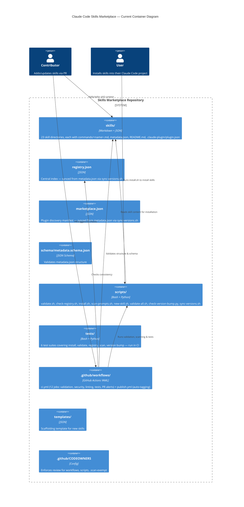

<!--
doc: ARCHITECTURE_REVIEW
last-refreshed: 2026-04-07
generated-by: doc-refresh skill
-->

# Architecture Review — Claude Code Skills Marketplace — 2026-04-06

> Post-fix review. Original findings identified and remediated in this session.

> **Note (2026-04-07):** `scripts/install.sh` was removed after this review was written.
> Skills are now distributed exclusively via the Claude Code marketplace mechanism
> (`~/.claude/settings.json`). References to `install.sh` in the C4 diagram and
> test coverage list below reflect the state at time of writing.

## As-Is Architecture (Post-Fix)

## Quality Attribute Summary

| Attribute | Rating | Key Issues |
|-----------|--------|------------|
| Maintainability | **OK Good** | Version sync script provides single source of truth; legacy skill.md references removed |
| Scalability | **OK Good** | Static content, no runtime services — scales inherently |
| Reliability | **OK Good** | CI pipeline has 12 independent jobs including test suite |
| Testability | **OK Good** | Tests run in CI; `eval` replaced with safe direct invocation |
| Observability | **Concern** | No changelog automation, no PR size/impact metrics |
| Security | **OK Good** | CI injection vectors fixed; CODEOWNERS enforces review; .scan-exempt changes trigger alerts |

## Quality Attribute Details

### Maintainability

- [x] Clear separation of concerns — skills, scripts, CI, schema, and tests are well-separated
- [x] No circular dependencies — N/A (no module imports)
- [ ] **No "God files"** — `ci.yml` at 430 lines has grown further with new jobs; still a single file containing 12 jobs with inline Python scripts
- [x] Consistent patterns across similar modules — `sync-versions.sh` provides automated version synchronization from `metadata.json` as the single source of truth
- [x] Domain logic not scattered across layers — skill content stays in skill dirs, tooling in scripts/
- [x] Legacy `skill.md` references removed from `scan-prompts.sh` and `SECURITY.md`

### Scalability

- [x] Static content — no runtime services, no database, no session state
- [x] Skills are self-contained directories — adding new skills is O(1) to the structure
- [x] Registry is flat JSON — no complex querying needed

### Reliability

- [x] CI pipeline has 12 independent jobs covering structure, schema, registry, commands, versions, plugins, prompts, shellcheck, secrets, markdown, tests, and .scan-exempt alerting
- [x] Each job has a 10-minute timeout
- [x] Publish workflow gates on CI success before tagging
- [x] Test suite runs in CI (`test` job)

### Testability

- [x] Tests exist for all core scripts (install, validate, check-registry, scan-prompts, version-bump)
- [x] Tests run in CI via the `test` job
- [x] `eval` replaced with safe `"$@"` in both `validate-all.sh` and `tests/run-all.sh`
- [ ] **No test for `new-skill.sh`** — The scaffolding script has no test coverage
- [ ] **No test for `sync-versions.sh`** — The new version sync script has no test coverage

### Observability

- [x] CI jobs produce clear pass/fail output with `::error::` annotations
- [x] `.scan-exempt` changes trigger PR comments alerting reviewers
- [ ] **No PR impact metrics** — No automated reporting of how many skills changed, lines added, etc.
- [ ] **No changelog generation in CI** — CHANGELOG.md is manually maintained

### Security Posture

- [x] Gitleaks integrated for secret scanning
- [x] `scan-prompts.sh` catches dangerous patterns in skill content (only scans authoritative `commands/<name>.md`)
- [x] `.env` properly gitignored
- [x] CI permissions minimized (`contents: read` for CI, `contents: write` only for publish)
- [x] CI script injection vectors fixed — `github.base_ref` and step outputs passed via env vars, inline Python uses `sys.argv`
- [x] CODEOWNERS enforces review for `.github/workflows/`, `scripts/`, and `.scan-exempt`
- [x] `.scan-exempt` changes trigger automated PR comments
- [x] All inline Python in shell scripts uses `sys.argv` — no shell variable interpolation into Python strings

## Resolved Anti-Patterns

### [RESOLVED] Quadruple Version Sync

- **Was:** Every skill version stored in 4 places; manual quadruple update required.
- **Now:** `scripts/sync-versions.sh` reads `metadata.json` as single source of truth and updates `registry.json`, `marketplace.json`, and `plugin.json` automatically. Supports `--check` flag for CI validation.
- **Remaining work:** The 3 cross-validation CI jobs (`validate-registry-metadata`, `validate-plugin-versions`, and partially `registry`) are still present. They serve as a safety net but could eventually be replaced by `sync-versions.sh --check`.

### [RESOLVED] Legacy `skill.md` References

- **Was:** `scan-prompts.sh` scanned both `commands/<name>.md` and `skill.md`; `SECURITY.md` referenced `skill.md`.
- **Now:** Scanner only reads `commands/<name>.md`. `SECURITY.md` updated. Stale comments cleaned up.
- **Remaining work:** The `skill.md` file deletions are staged in git but not yet committed. They should be included in the next commit.

### [RESOLVED] Inline Python Injection

- **Was:** Shell variables interpolated directly into Python strings in `install.sh`, `check-registry.sh`, `ci.yml`, `validate-all.sh`, `tests/run-all.sh`.
- **Now:** All inline Python uses `sys.argv` for file path arguments. `eval` replaced with direct `"$@"` invocation.

### [RESOLVED] Test Suite Not in CI

- **Was:** 6 test suites in `tests/` never run in CI.
- **Now:** `test` job added to `ci.yml` running `bash tests/run-all.sh` with Python 3.12.

### [RESOLVED] No CODEOWNERS

- **Was:** No enforced review for security-sensitive paths.
- **Now:** `.github/CODEOWNERS` requires `@RealDougEubanks` review for workflows, scripts, `.scan-exempt`, and CODEOWNERS itself.

### [RESOLVED] No .scan-exempt Alerting

- **Was:** Changes to `.scan-exempt` files were invisible in PR reviews.
- **Now:** `scan-exempt-alert` CI job detects and comments on PRs when `.scan-exempt` files change.

## Remaining Findings

### [LOW] CI Workflow as "God File"

- **Description:** `.github/workflows/ci.yml` is now 430 lines containing 12 jobs with 5 inline Python scripts. It handles validation, security scanning, linting, testing, and PR-interaction logic.
- **Impact:** Hard to maintain. Inline Python scripts are untestable in isolation.
- **Migration path:**
  1. Extract the 5 inline Python scripts (check-commands, validate-registry-metadata, validate-plugin-versions, label-tools detect, scan-exempt-alert) to standalone `.py` files in `scripts/`.
  2. Consider splitting into `ci-validate.yml` and `ci-security.yml`.
- **Effort:** M | **Risk:** Low

### [LOW] Missing Tests for New and Existing Scripts

- **Description:** `new-skill.sh` and the newly created `sync-versions.sh` have no test coverage.
- **Migration path:** Add `tests/test-new-skill.sh` and `tests/test-sync-versions.sh`.
- **Effort:** S | **Risk:** Low

### [LOW] No Changelog Automation

- **Description:** CHANGELOG.md is manually maintained. Changes can be missed.
- **Migration path:** Add a CI job or pre-release script that generates changelog entries from git history or PR titles.
- **Effort:** S | **Risk:** Low

## Migration Roadmap (Remaining)

| Priority | Finding | Effort | Risk |
|----------|---------|--------|------|
| P1 | Extract CI inline Python to standalone scripts | M | Low |
| P2 | Add tests for new-skill.sh and sync-versions.sh | S | Low |
| P3 | Split CI into focused workflow files | M | Low |
| P4 | Add changelog automation | S | Low |

## Strengths

This is a well-structured project for its domain (a curated collection of prompt skills):

1. **Strong schema enforcement** — JSON Schema for metadata, YAML frontmatter validation, registry cross-checks
2. **Defense-in-depth for prompt safety** — Pattern scanning with exemption mechanism, code-fence stripping, HIGH/MEDIUM severity tiers
3. **Comprehensive CI** — 12 independent validation jobs covering structure, schema, security, quality, and tests
4. **Clean separation** — Each skill is self-contained; no inter-skill dependencies
5. **Good contributor tooling** — `new-skill.sh` scaffolds correct structure; `validate.sh` provides fast local checks; `sync-versions.sh` eliminates manual version sync
6. **Test coverage for core scripts** — 6 test suites run in CI
7. **Security hardening** — No shell injection in scripts, CODEOWNERS, .scan-exempt alerting, CI uses env vars for all untrusted inputs
