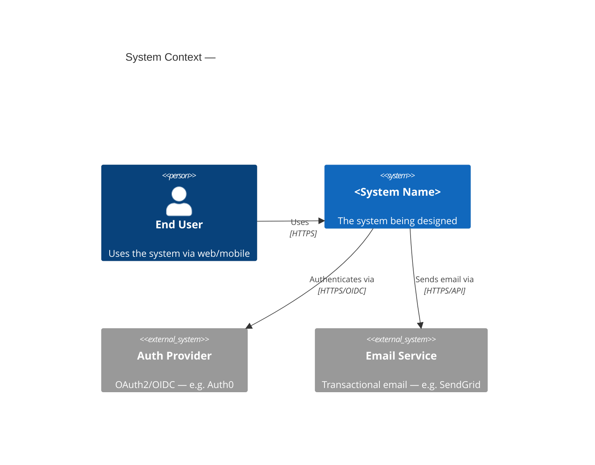

# architecture-design

## Purpose

Guide the design of a system or feature from requirements to a documented architecture. Produces C4-model diagrams (Context → Container → Component), service boundary definitions, API contracts, data flow diagrams, failure mode analysis, and an ADR for the key decisions made. Works standalone or as the `/abd-design` agent in the ABD workflow.

---

## Instructions

### Step 1 — Gather inputs

Ask the user for (or read from existing artifacts):
- What are we building? (description or link to requirements doc / Jira epic)
- What are the key constraints? (team size, existing systems to integrate with, cloud provider, language preference, compliance requirements)
- What is the expected scale? (users/day, requests/second, data volume)
- What is the timeline? (affects how complex a solution is appropriate)
- Are there existing systems this must integrate with or replace?

If `docs/requirements/` exists, use Glob and Read to load relevant requirements documents.

---

### Step 2 — Propose architecture style

Based on the inputs, recommend and justify one of these patterns. Explain the tradeoffs in the context of the stated constraints:

| Pattern | Best For | Avoid When |
|---------|----------|------------|
| Monolith (Modular) | Small teams, early stage, unclear domain boundaries | Team > 10, independent scaling needed |
| Microservices | Large teams, independent scaling, polyglot | Small team, immature domain model |
| Event-Driven | Async workflows, loose coupling, audit trail needed | Simple CRUD, low latency required |
| Hexagonal (Ports & Adapters) | Complex domain logic, testability, multiple I/O adapters | Simple CRUD apps |
| CQRS + Event Sourcing | Complex queries, audit history, high write/read ratio difference | Simple domains, small teams |
| Serverless | Unpredictable traffic, low ops overhead, event-driven | Long-running jobs, high cold-start sensitivity |
| BFF (Backend for Frontend) | Multiple client types with different data needs | Single client type |

Ask the user to confirm the pattern before proceeding.

---

### Step 3 — C4 Model — Level 1: System Context

Produce a Mermaid diagram showing the system in context:
- The system being built (center)
- External users/actors
- External systems it integrates with
- Data flows between them

If C4 Mermaid syntax is not supported, use `graph LR` with clear labels.

---

### Step 4 — C4 Model — Level 2: Container Diagram

Decompose the system into containers (deployable units):
- Web frontend (SPA, SSR, mobile app)
- API server(s)
- Background workers / queues
- Databases (type: relational, document, cache, search)
- Message broker (if event-driven)
- CDN / static assets

For each container specify: technology choice, responsibility, and communication protocol with other containers.

---

### Step 5 — C4 Model — Level 3: Component Diagram (key containers only)

For the most complex container (usually the API server), decompose into components:
- Router / Controller layer
- Service / Use Case layer
- Repository / Data Access layer
- Domain Model
- External adapters (email, payment, auth)
- Shared utilities (logging, validation, config)

---

### Step 6 — Data Design

- Identify the core entities and their relationships (ER diagram in Mermaid)
- Recommend database type for each store: relational (normalized, ACID), document (flexible schema), key-value (cache/session), time-series (metrics/events), search (full-text)
- Flag any PII/sensitive data and where encryption at rest is required
- Identify high-read vs high-write data and caching strategy

---

### Step 7 — API Contract Sketch

For each major API surface, define:
- Protocol: REST, GraphQL, gRPC, WebSocket, or event/message
- Key endpoints/operations (resource name, method, brief description)
- Authentication mechanism (JWT, API key, OAuth2 scopes)
- Pagination strategy (cursor vs offset)
- Error response format

---

### Step 8 — Failure Mode Analysis

For each external dependency and critical path, define:
- What happens if this fails?
- Mitigation: retry with backoff, circuit breaker, graceful degradation, fallback, queue
- Recovery time objective (RTO) — how quickly must this recover?

---

### Step 9 — Cross-Cutting Concerns

Address explicitly:
- **Authentication & Authorization**: where auth is enforced, which framework/library
- **Observability**: structured logging, distributed tracing (trace IDs), metrics, alerting
- **Configuration**: how env vars / secrets are managed per environment
- **Deployment**: container/serverless, CI/CD pipeline shape, blue/green vs rolling
- **Testing strategy**: unit (domain logic), integration (adapters), contract (API), E2E (critical flows)

---

### Step 10 — Write Design Artifact

Use Write to save the full design to `docs/architecture/<feature-or-system-name>-design.md`.

If `handoffs/designs/` exists (ABD workflow), also write a JSON artifact to `handoffs/designs/{taskId}_design_{unixTimestamp}.json` using the ABD envelope schema.

Offer to run `/adr` to capture the key architectural decisions as ADRs.

---

## Output Format

The design document should contain all diagrams inline as Mermaid fenced code blocks, all tables, and a "Key Decisions" section summarising the choices made and why. End with "Open Questions" — any decisions that need stakeholder input before implementation begins.
