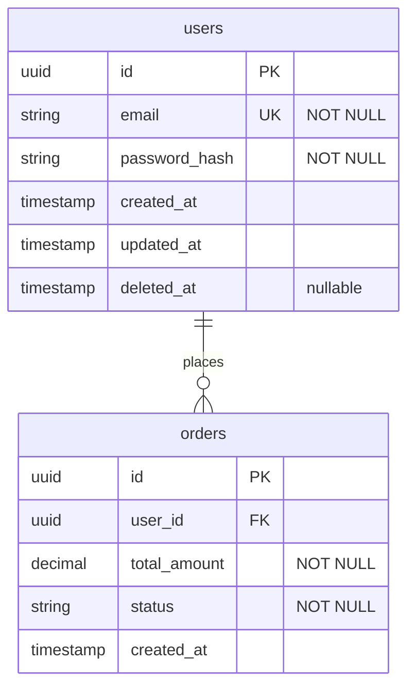

# database-design

## Purpose
Design database schemas from domain requirements, or audit existing schemas for normalization issues, missing indexes, unsafe migrations, and scalability risks. Produces ERD diagrams, migration files, and index recommendations.

## Instructions

### Step 1 — Determine mode
- **Design mode** (default): design a new schema from requirements
- **Review mode** (`/database-design --review`): audit an existing schema

---

### DESIGN MODE

### Step 2 — Gather inputs
Ask for: domain description, expected data volume (rows/table at 1 year), read vs write ratio, any existing schema to extend, compliance requirements (PII, HIPAA, PCI — affects encryption and retention).

**Step 3 — Choose database type(s)**
Recommend and justify:

| Type | Use When |
|------|----------|
| Relational (PostgreSQL, MySQL) | Structured data, ACID transactions, complex queries, financial/inventory |
| Document (MongoDB) | Variable schema, nested data, rapid iteration, content |
| Key-Value (Redis, DynamoDB) | Session, cache, leaderboards, feature flags |
| Time-Series (TimescaleDB, InfluxDB) | Metrics, IoT, audit logs, events |
| Search (Elasticsearch, Meilisearch) | Full-text search, faceted filtering |
| Graph (Neo4j) | Highly relational data: social networks, recommendations |

### Step 4 — Entity and Relationship Modeling

Identify entities from the domain. For each entity:
- Name (singular noun, snake_case table name)
- Fields: name, type, constraints (NOT NULL, UNIQUE, DEFAULT), description
- Primary key strategy: UUID vs auto-increment (UUID for distributed systems, auto-increment for simplicity)
- Timestamps: always include `created_at`, `updated_at`
- Soft delete: include `deleted_at` for business-critical records

Relationships:
- One-to-many: FK on the "many" side
- Many-to-many: junction table with composite PK or separate `id`
- One-to-one: FK with UNIQUE constraint

Produce a Mermaid ERD:

**Step 5 — Normalization**
Apply 3NF by default. Flag denormalization decisions and document them in `docs/assumptions.md` with justification (usually read performance).

**Step 6 — Index Strategy**
For each table, recommend indexes:
- Primary key index (automatic)
- Unique indexes (email, slug, external IDs)
- Foreign key indexes (always — prevents full table scans on joins)
- Composite indexes for common query patterns: `(user_id, created_at DESC)` for "user's recent orders"
- Partial indexes for filtered queries: `WHERE deleted_at IS NULL`
- Full-text indexes for search fields

### Step 7 — Security and Compliance
- Identify PII fields (email, name, phone, address, SSN, DOB) — recommend encryption at rest or column-level encryption
- Recommend row-level security (PostgreSQL RLS) for multi-tenant schemas
- Define data retention policy for sensitive tables
- Recommend audit log table for sensitive mutations (who changed what, when)

**Step 8 — Migration Strategy**
For each schema change, produce a migration file (SQL or ORM-specific):
- Always backwards compatible: add columns as nullable first, populate, then add NOT NULL constraint
- Never: DROP COLUMN or RENAME COLUMN without a deprecation period
- Long-running migrations (adding indexes on large tables): use `CREATE INDEX CONCURRENTLY`
- Multi-step migrations for zero-downtime deployments

**Step 9 — Save**
Write ERD to `docs/database/schema.md`. Write migration files to `db/migrations/` or `migrations/`.

---

### REVIEW MODE (`/database-design --review`)

### Step 1 — Discover schema
Use Glob to find: migration files (`db/migrations/**`, `migrations/**`, `**/schema.sql`), ORM model files (`**/models/**`, `**/entities/**`), schema definitions (`schema.prisma`, `**/schema.rb`).

### Step 2 — Audit checklist

**Normalization:**
- [ ] No repeating groups (arrays of values in a single column — use a junction table)
- [ ] No transitive dependencies (field depends on non-PK field — violates 3NF)
- [ ] No duplicate data across tables without documented justification

**Indexes:**
- [ ] Every foreign key column has an index
- [ ] Columns used in WHERE clauses in common queries have indexes
- [ ] Columns used in ORDER BY have indexes (especially with LIMIT)
- [ ] Unique constraints exist for business-unique fields (email, username, slug)
- [ ] No redundant indexes (index on (a,b) makes index on (a) redundant for most queries)

**Data Integrity:**
- [ ] Foreign key constraints defined (not just column naming convention)
- [ ] NOT NULL on required fields
- [ ] CHECK constraints on enum-like fields (`status IN ('active','inactive','pending')`)
- [ ] Timestamps (`created_at`, `updated_at`) on all tables
- [ ] Soft delete pattern consistent across tables

**Security:**
- [ ] PII fields identified and encrypted or tokenized
- [ ] Passwords stored as hashes (never plaintext)
- [ ] Row-level security for multi-tenant data
- [ ] Audit log for sensitive mutations

**Migrations:**
- [ ] All schema changes are in versioned migration files (not applied manually)
- [ ] Migrations are backwards compatible (no breaking changes to running app)
- [ ] Large table migrations use CONCURRENTLY or batching
- [ ] Rollback migration exists for each forward migration

**Performance:**
- [ ] No N+1 patterns visible in ORM model associations
- [ ] Large text/blob fields stored separately (or in object storage with URL reference)
- [ ] Partition strategy for tables expected to exceed 100M rows
- [ ] Connection pool configured appropriately

**Step 3 — Output report**
Severity-graded findings (Critical/High/Medium/Low) with specific fix recommendations and migration SQL where applicable.
